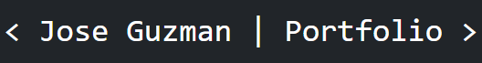
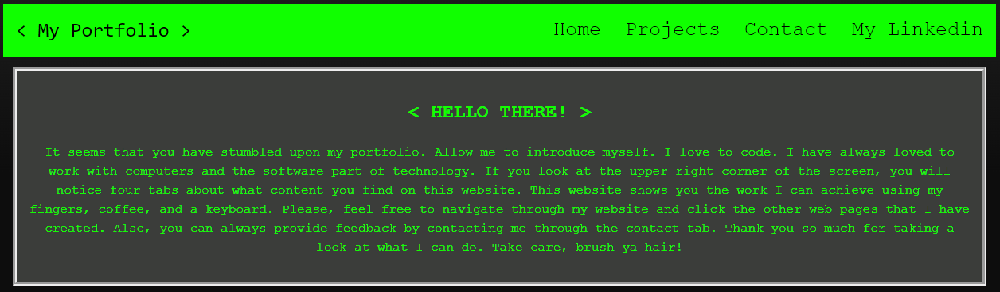

# Jose Guzman's Portfolio

## Description

Compact display of my portfolio through React.js

## Previews

## New and improved Portfolio

Below is my New and Improved Portfolio. This time it is being ran through react.js

Live Preview

## Old Portfolio

My Portfolio includes a navbar where the visitor can navigate through the first webpage as well as go directly to my linked in. If the said visitor would like to contact me they may by going to the "Contact" tab, which then redirects them to a form where they then submit some feedback or comments.

## Link to Application

* Here is the link : [JMGuzman-784/react-portfolio]https://github.com/JMGuzman-784/react-portfolio)
* Here is the webpage: [JMGuzman-784/react-heroku-portfolio](https://jmguzman-784.github.io/portfolio/)

## Contact Information

* Email Address: Josemguzman784@gmail.com
* Linkedin Profile: [My Linkedin Page](https://www.linkedin.com/in/guzmanjose86/) 